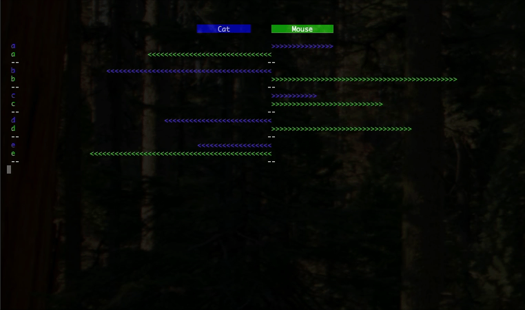

## Cat and Mouse
This project is an examination of the concepts of distance and relative motion and how these concepts can reasonably extend beyond our intuitive understandings in 2 and 3 dimensions. 

### Description
This program models the positions of a ***cat*** and a ***mouse*** as one chases the other through an **n**-dimensional space. As it so happens, this cat can only run exactly as fast as the mouse, and must therefore employ a clever tactic if it wishes to catch the mouse. As the cat is chasing the mouse, it follows two simple rules to determine what path it will take.
1. If the mouse's velocity has no component in the direction of the cat, the the cat's velocity is equal to the mouse's velocity. In other words, if the mouse is not moving at all towards the cat, then the cat parallels the mouses path.
2. If the mouse's velocity has any component in the direction of the cat, the cat's velocity is the unit vetor that extens from that cats current position to the point `[mp + (|d|mv/2cosθ)]` where **mp** is the mouse's position vector, **d** is the vector that extends from the mouse's position to the cat's position, **mv** is the unit vector that represents the mouses velocity, and θ is the angle between **mv** and **d**. In other words, if the mouse is moving at all toward the cat, the cat takes the path that will intersect the mouse if it continues along its current path.

With these 2 rules the cat can ensure that it will never lose any ground that it gains on the mouse, and as long as the space is bounded by a fence or walls or some kind of n-dimensional barrier, the cat will always catch the mouse in finite time.

