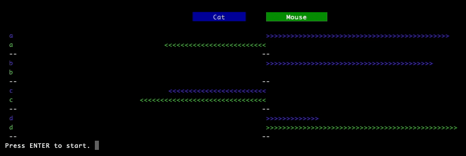

## Cat and Mouse
This project is an examination of the concepts of distance and direction and how these concepts can extend beyond our intuitive understandings in 2 and 3 dimensions. 

### Description
This program models the positions of a ***cat*** and a ***mouse*** as one chases the other through an **n**-dimensional space. As it so happens, this cat can only run exactly as fast as the mouse, and must therefore employ a clever tactic if it wishes to catch the mouse. As the cat is chasing the mouse, it follows two simple rules to determine what path it will take.
1. If the mouse's velocity has no component in the direction of the cat, the the cat's velocity is equal to the mouse's velocity. In other words, if the mouse is not moving at all toward the cat, then the cat parallels the mouses path.
2. If the mouse's velocity has any component in the direction of the cat, the cat's velocity is the unit vector that extends from that cats current position to the point `[mp + (|d|mv/2cosθ)]` where **mp** is the mouse's position vector, **d** is the vector that extends from the mouse's position to the cat's position, **mv** is the unit vector that represents the mouses velocity, and θ is the angle between **mv** and **d**. In other words, if the mouse is moving at all toward the cat, the cat takes the path that will intersect the mouse if it continues along its current path.

With these 2 rules the cat can ensure that it will never lose any ground that it gains on the mouse, and as long as the space is bounded by a fence or walls or some kind of n-dimensional barrier, the cat will always catch the mouse in finite time. In this model the space is not bounded, but the same effect is achieved by making the mouse's path random which ensures that it will not continue off in the same direction forever.
##### What Does it Mean?
In reality, there are probably no 5 dimensional mice being hunted by 5 dimensional cats, so what does all this mean? The important part of this analogy is that the cat can use one simple formula `[mp + (|d|mv/2cosθ)]` to find its heading in 1, 2, 3, .... ,or n dimension. This demonstrates a type of continuity across dimensions thats not very intuitive. In particular, it may be hard to conceive of the fact that 2 points in a 5 dimensional space can be at some ***distance*** from each other, and that there is some ***straight line*** that connects one to the other. With respect to these ideas, we may intuit that there is some conceptual leap that is made as soon as we go from 3 to 4 dimension, but this leap is actually made when we go from 1 to 2 dimensions. In a 1 dimensional space the concept of distance is quite clear. The value of a point is its distance from the origin, and the distance between 2 points is the absolute value of the difference of their values. All of this becomes more complicated as soon as we move to 2 dimensions. We solve this in a practical sense by orienting or frame of reference so that one point lies at the origin and the other lies along one of our axis. We can then act as though our points are inhabiting a 1 dimensional space and simply count the distance from one to the other. While in 2 and 3 dimensions this type of transformation usually consists of pulling out a tape measurer, this reorientation extends mathematically to any number of dimensions. Apart from the fact that we cannot inhabit or imagine a 5 dimensional spaces, notions of distance and straight line paths are as real in 5 dimensions as they are in 2 and 3.
### Installation 
* Clone the repository
* Navigate to the project directory
* (Optional) Set up a virtual environment 
* Install dependencies

```bash
pip install -r requirements.txt
```
### Usage
* Run the program in the command line

```bash
python3 cat_n_mouse.py
```
* A prompt will ask how many dimensions you would like the chase to be. Recommended is between 2 and 5.
* Enter `y` or `n` to the second prompt depending if you wand it in straight line mode.
* Random starting positions will be chosen for the cat and the mouse. After the graph is displayed press `Enter` to start the simulation.
## Features
#### Straight Line Chase
If you enter `y` to the second prompt, the chase will be in straight line mode which means that the mouse will not move. This shows the straight line path of the cat as it moves toward the mouse.
#### The Graph
The graph shows the value of each component of position of both the cat and mouse. The blue bars are components of the cat's position and the green bars are of the mouses position. The components are labled a, b, c ... and like components of the cat and mouse are next to each other.

 

The above graph is an example of a 2 dimensional graph. The components are labeled **a** and **b** but these can be thought of as representing the x, y coordinates of the cat and mouse. While the horizontal axis is not marked with values that could be used to read off the actual positions, one could estimate that the cat is at about (-30. -28) and the mouse is at about (40, 23).
#### Chase Metrics
After the simulation several metrics are displayed below the graph
* `Initial Distance` - The straight line distance from the starting position of the cat to the starting position of the mouse.
* `n` - The total distance traveled by the cat as it chased the mouse. Note that if the mouse stayed still, this would be equal to the initial distance.
* `dim` - The number of dimensions of the chase.
* `Average Rate of Closure` - This value is the **initial distance** divided by **n**. Because the cats velocity is a unit vector, this value represents the average rate at which the cat closed the gap between it and the mouse. If the mouse were standing still this value would be one. An interesting question may be how this value varies as a function of the initial distance and the dimensionality of the chase.
